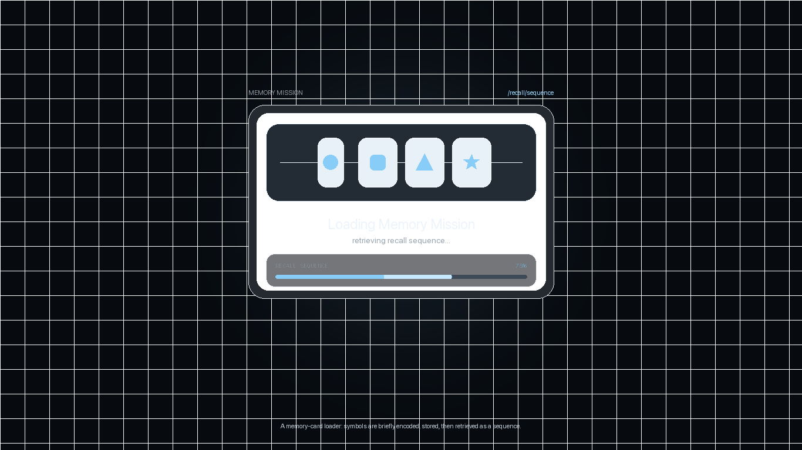

# Memory Mission Recall Card Loader

A polished loading-screen concept for Memory Mission, inspired by the original website's dark working-directory interface and a memory-card recall task.



## Concept

The loader uses four minimal memory cards. Each card flips in sequence while a 0-100% progress bar shows the recall sequence loading. The educational caption stays small and secondary so the page still reads as a loading screen.

## Palette

| Role | Hex |
| --- | --- |
| Background | `#040814` |
| Deep navy | `#07111F` |
| Surface | `#0D131A` |
| Panel | `#111A23` |
| Text | `#EDF5FF` |
| Muted text | `#9DAFC1` |
| Blue accent | `#88CDF8` |
| Card fill | `#E8F1F8` |

## Typography

The prototype uses Apple-style system typography:

```css
font-family: "SF Pro Display", "SF Pro Text", -apple-system, BlinkMacSystemFont, "Inter", "Helvetica Neue", Arial, sans-serif;
```

If SF Pro is installed, the page will use it automatically. Otherwise it falls back to the system font stack.

## Run Locally

Open `index.html` in a browser.

## Publish With GitHub Pages

1. Create a public GitHub repository.
2. Upload `index.html`, `preview.png`, `preview.gif`, and this `README.md`.
3. In GitHub, go to **Settings → Pages**.
4. Set the source to the `main` branch and the root folder.
5. Your public demo link will appear after GitHub Pages finishes deploying.
